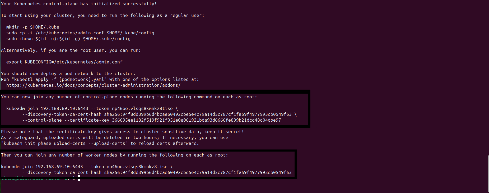

# Kubernetes Cluster Installatie met Rancher

## Loadbalancer

### Installeer HAProxy

```bash
sudo apt update && sudo apt install -y haproxy
```

### Configureer HAProxy

Bewerk de configuratie:

```bash
sudo nano /etc/haproxy/haproxy.cfg
```

Voeg de volgende configuratie toe:

```
frontend kubernetes-frontend
    bind <ip-loadBalancer>:6443
    mode tcp
    option tcplog
    default_backend kubernetes-backend

backend kubernetes-backend
    mode tcp
    balance roundrobin
    option tcp-check
    server master-1 <Ip-Master-1>:6443 check
    server master-2 <Ip-Master-2>:6443 check
    server master-3 <Ip-Master-3>:6443 check
```

### Herstart en activeer HAProxy

```bash
sudo systemctl restart haproxy
sudo systemctl enable haproxy
```

### Verifieer

```bash
nc <ip-loadBalancer> -v
```

## Stap 2: Bereid alle nodes voor (behalve Load Balancer)

### Schakel Swap uit

```bash
sudo swapoff -a
sudo sed -i '/swap/d' /etc/fstab
```

### Configureer Kernel Parameters

```bash
cat <<EOF | sudo tee /etc/sysctl.d/99-kubernetes-cri.conf
net.bridge.bridge-nf-call-iptables  = 1
net.ipv4.ip_forward                 = 1
net.bridge.bridge-nf-call-ip6tables = 1
EOF
sudo sysctl --system
```

### Laad vereiste Kernel Modules

```bash
sudo modprobe overlay
sudo modprobe br_netfilter

cat <<EOF | sudo tee /etc/modules-load.d/containerd.conf
overlay
br_netfilter
EOF
```

## Stap 3: Voeg Kubernetes Repository toe

```bash
sudo mkdir -p -m 755 /etc/apt/keyrings

curl -fsSL https://pkgs.k8s.io/core:/stable:/v1.33/deb/Release.key | sudo gpg --dearmor -o /etc/apt/keyrings/kubernetes-apt-keyring.gpg

echo "deb [signed-by=/etc/apt/keyrings/kubernetes-apt-keyring.gpg] https://pkgs.k8s.io/core:/stable:/v1.33/deb/ /" | sudo tee /etc/apt/sources.list.d/kubernetes.list
```

## Stap 4: Installeer Kubernetes Componenten

```bash
sudo apt-get update
sudo apt-get install -y kubelet kubeadm kubectl
sudo apt-mark hold kubelet kubeadm kubectl
```

## Stap 5: Installeer en configureer Container Runtime (containerd)

```bash
sudo apt-get install -y containerd
sudo mkdir -p /etc/containerd

containerd config default | sudo tee /etc/containerd/config.toml > /dev/null
sudo sed -i 's/SystemdCgroup = false/SystemdCgroup = true/' /etc/containerd/config.toml

sudo systemctl restart containerd
sudo systemctl enable containerd
```

Activeer kubelet:

```bash
sudo systemctl enable kubelet
```

## Stap 6: Initialiseer Kubernetes Control Plane

Voer dit uit op één control plane node:

```bash
sudo kubeadm init \
  --control-plane-endpoint "<IP-Master-1>:6443" \
  --upload-certs \
  --pod-network-cidr=10.244.0.0/16
```

Bewaar het join commando uit de output.



## Stap 7: Configureer kubectl op Primary Master

```bash
mkdir -p $HOME/.kube
sudo cp -i /etc/kubernetes/admin.conf $HOME/.kube/config
sudo chown $(id -u):$(id -g) $HOME/.kube/config
```

## Stap 8: Voeg extra nodes toe

Gebruik de output gegevens van stap 6

### Voorbeeld voor Masters

```bash
kubeadm join 192.168.2.10:6443 --token <token> \
  --discovery-token-ca-cert-hash sha256:<hash> \
  --control-plane --certificate-key <cert-key>
```

### Voorbeeld voor Workers

```bash
kubeadm join 192.168.2.10:6443 --token <token> \
  --discovery-token-ca-cert-hash sha256:<hash>
```

## Stap 9: Installeer Network Plugin (Calico)

Voer uit op Primary-Master-Node:

```bash
kubectl apply -f https://raw.githubusercontent.com/projectcalico/calico/v3.26.1/manifests/calico.yaml
```

Controleer status:

```bash
kubectl get nodes
```

Als een node NotReady is, herstart kubelet:

```bash
sudo systemctl restart kubelet
```

## Stap 10: Verifieer ETCD Cluster

### Installeer etcd client

```bash
sudo apt update && sudo apt install -y etcd-client
```

### Controleer members

```bash
ETCDCTL_API=3 etcdctl member list \
  --endpoints=https://127.0.0.1:2379 \
  --cacert=/etc/kubernetes/pki/etcd/ca.crt \
  --cert=/etc/kubernetes/pki/etcd/server.crt \
  --key=/etc/kubernetes/pki/etcd/server.key
```

## Rancher installeren

### Vereisten

- 3 Masters
- 3 Workers
- Kubectl

### Stap 1: Voeg de Rancher Helm Repository toe

```bash
helm repo add rancher-latest https://releases.rancher.com/server-charts/latest
helm repo update
```

### Stap 2: Maak de namespace voor Rancher aan

```bash
kubectl create namespace cattle-system
```

### Stap 3: Installeer Rancher

```bash
helm install rancher rancher-latest/rancher \
  --namespace cattle-system \
  --set replicas=1 \
  --set ingress.enabled=false \
  --set bootstrapPassword=admin
```

### Stap 4: Controleer Rancher Service

```bash
kubectl get svc -n cattle-system
```

### Stap 5: Installeer cert-manager

**Opmerking:** Vervang `<VERSION>` hieronder met de gewenste versie (bijv. `v1.13.0`). Controleer de [releases pagina](https://github.com/cert-manager/cert-manager/releases) voor de nieuwste versie.

```bash
kubectl apply -f https://github.com/cert-manager/cert-manager/releases/download/<VERSION>/cert-manager.crds.yaml

helm repo add jetstack https://charts.jetstack.io
helm repo update

helm install cert-manager jetstack/cert-manager \
  --namespace cert-manager \
  --create-namespace \
  --set crds.enabled=true
```

### Stap 6: Converteer Rancher Service naar NodePort

```bash
kubectl patch svc rancher -n cattle-system -p '{"spec": {"type": "NodePort"}}'
kubectl get svc -n cattle-system
```

### Stap 7: Open Rancher in de Browser

Ga in de browser naar: `https://<Primary-master-IP>:<NodePort>`

## Screenshots toevoegen

Om screenshots toe te voegen aan deze README:

1. Maak een map aan voor afbeeldingen (bijv. `images/` of `screenshots/`)
2. Plaats je screenshots in deze map
3. Voeg ze toe aan de README met markdown syntax:

```markdown

```

Voorbeeld:

```markdown
### Rancher Dashboard


Dit is het Rancher dashboard na succesvolle installatie.
```
